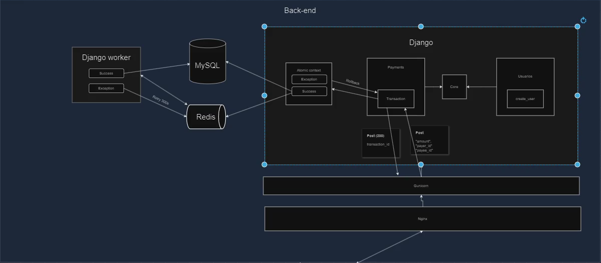

# PicPay Simplified - Backend

## Description
This project is a RESTful API developed as part of a technical challenge to create a simplified payment platform, inspired by PicPay. The application allows users and merchants to transfer money between themselves, with features such as:

- Registration of users and merchants, ensuring uniqueness of CPF/CNPJ and emails.
- Balance validation for transfers.
- Consultation of external services to authorize transfers and send notifications.
- Secure and reversible transactions in case of failures.

## Technologies Used
- **Language**: Python
- **Framework**: Django
- **API Framework**: [Django Ninja](https://django-ninja.rest-framework.com/)
- **Messaging and Asynchronous Processing**: Redis and Celery
- **Authentication**: JWT (JSON Web Token)

## Main Features

### 1. User Registration
- Allows you to create users or merchants.
- Guaranteed uniqueness for CPF and email.
- Passwords stored securely with hashing.

### 2. Authentication and JWT Token Generation
- User login to obtain a JWT token.
- Token validation to access protected routes.

### 3. Transfers between Users
- Payer balance validation.
- Restriction so that merchants only receive transfers.
- Consultation of an external service mock for transaction authorization.
- Transactions protected using Django's atomic transactions.

### 4. Transfer Notification
- Sending notifications using Celery to ensure scalability and handle instabilities in the notification service.

## Project Structure



## Available Endpoints

### **Authentication**
- `POST /login/`
- Parameters: `username`, `password`
- Returns: JWT Token

### **User Registration**
- `POST /users/`
- Parameters: Full name, CPF/CNPJ, email, password, user type (regular or merchant).
- Returns: ID of the created user.

### **Transfers**
- `POST /transaction/`
- Parameters: Transaction amount, payer ID, recipient ID.
- Returns: Transaction details.

## Setup and Execution

### 1. Clone the Repository
```bash
git clone <REPOSITORY_URL>
cd <REPOSITORY_NAME>
```

### 2. Set up the Virtual Environment
```bash
python -m venv venv
source venv/bin/activate # Linux/Mac
venv\Scripts\activate # Windows
```

### 3. Install Dependencies
```bash
pip install -r requirements.txt
```

### 4. Set up Environment Variables
Create a `.env` file with the following variables:
```env
SECRET_KEY_JWT=YourSecretKeyHere
CELERY_BROKER_URL=redis://localhost:6379/0
AUTHORIZE_TRANSFER_ENDPOINT=https://run.mocky.io/v3/5794d450-d2e2-4412-8131-73d0293ac1cc
NOTIFICATION_ENDPOINT=https://run.mocky.io/v3/54dc2cf1-3add-45b5-b5a9-6bf7e7f1f4a6
```

### 5. Perform Migrations
```bash
python manage.py migrate
```

### 6. Start the Server
```bash
python manage.py runserver
```

### 7. Start the Celery
In another terminal, run:
```bash
celery -A project worker --loglevel=info
```

## Tests
Run the automated tests with the command:
```bash
python manage.py test
```

## Future Improvements
- Add test coverage for all features.
- Implement detailed logs with tools like Sentry.
- Improve application scalability by using additional queues and database shards.
- Create a monitoring system for transactions.
