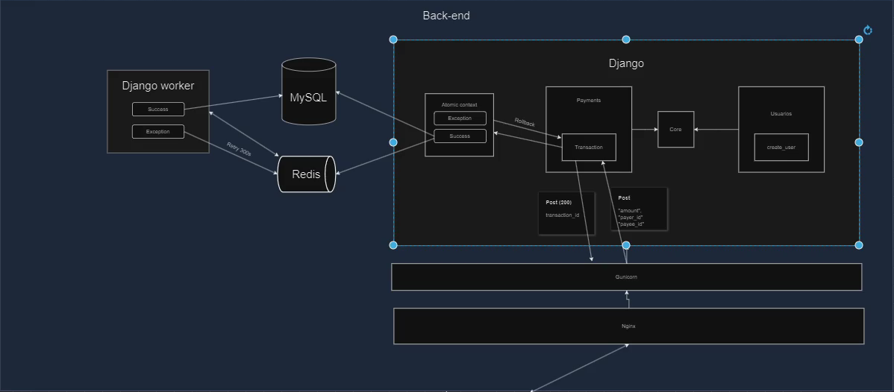

# PicPay Simplificado - Backend

## Descrição
Este projeto é uma API RESTful desenvolvida como parte de um desafio técnico para criar uma plataforma de pagamentos simplificada, inspirada no PicPay. A aplicação permite que usuários e lojistas realizem transferências de dinheiro entre si, com funcionalidades como:

- Cadastro de usuários e lojistas, garantindo unicidade de CPF/CNPJ e e-mails.
- Validação de saldo para transferências.
- Consulta a serviços externos para autorização de transferências e envio de notificações.
- Transações seguras e reversíveis em caso de falhas.

## Tecnologias Utilizadas
- **Linguagem**: Python
- **Framework**: Django
- **Framework para API**: [Django Ninja](https://django-ninja.rest-framework.com/)
- **Mensageria e Processamento Assíncrono**: Redis e Celery
- **Autenticação**: JWT (JSON Web Token)

## Funcionalidades Principais

### 1. Cadastro de Usuários
- Permite criar usuários ou lojistas.
- Garantia de unicidade para CPF e e-mail.
- Senhas armazenadas de forma segura com hashing.

### 2. Autenticação e Geração de Token JWT
- Login de usuários para obter um token JWT.
- Validação de tokens para acessar rotas protegidas.

### 3. Transferências entre Usuários
- Validação de saldo do pagador.
- Restrição para que lojistas apenas recebam transferências.
- Consulta a um mock de serviço externo para autorização de transação.
- Transações protegidas com o uso de transações atômicas do Django.

### 4. Notificação de Transferências
- Envio de notificações utilizando Celery para garantir a escalabilidade e tratar instabilidades no serviço de notificações.

## Arquitetura do Projeto



## Endpoints Disponíveis

### **Autenticação**
- `POST /login/`
  - Parâmetros: `username`, `password`
  - Retorna: Token JWT

### **Cadastro de Usuários**
- `POST /users/`
  - Parâmetros: Nome completo, CPF/CNPJ, e-mail, senha, tipo de usuário (comum ou lojista).
  - Retorna: ID do usuário criado.

### **Transferências**
- `POST /transaction/`
  - Parâmetros: Valor da transação, ID do pagador, ID do recebedor.
  - Retorna: Detalhes da transação.

## Configuração e Execução

### 1. Clone o Repositório
```bash
git clone <URL_DO_REPOSITORIO>
cd <NOME_DO_REPOSITORIO>
```

### 2. Configure o Ambiente Virtual
```bash
python -m venv venv
source venv/bin/activate  # Linux/Mac
venv\Scripts\activate   # Windows
```

### 3. Instale as Dependências
```bash
pip install -r requirements.txt
```

### 4. Configure as Variáveis de Ambiente
Crie um arquivo `.env` com as seguintes variáveis:
```env
SECRET_KEY_JWT=SuaChaveSecretaAqui
CELERY_BROKER_URL=redis://localhost:6379/0
AUTHORIZE_TRANSFER_ENDPOINT=https://run.mocky.io/v3/5794d450-d2e2-4412-8131-73d0293ac1cc
NOTIFICATION_ENDPOINT=https://run.mocky.io/v3/54dc2cf1-3add-45b5-b5a9-6bf7e7f1f4a6
```

### 5. Realize as Migrações
```bash
python manage.py migrate
```

### 6. Inicie o Servidor
```bash
python manage.py runserver
```

### 7. Inicie o Celery
Em outro terminal, execute:
```bash
celery -A project worker --loglevel=info
```

## Testes
Execute os testes automatizados com o comando:
```bash
python manage.py test
```

## Melhorias Futuras
- Adicionar cobertura de testes para todas as funcionalidades.
- Implementar logs detalhados com ferramentas como Sentry.
- Melhorar a escalabilidade da aplicação com o uso de filas adicionais e shards de banco de dados.
- Criar um sistema de monitoramento para as transações.


